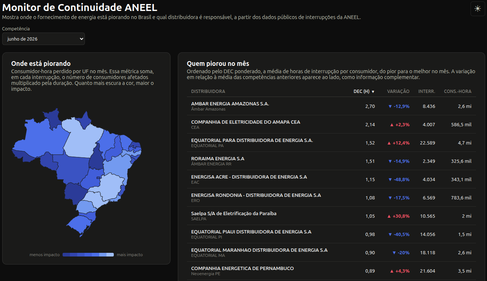

# Monitor de Continuidade: Distribuidoras de Energia (ANEEL)

[](https://github.com/alveshenriique/monitor-continuidade-aneel/actions/workflows/testes.yml)
[](LICENSE)


Painel que mostra **onde o fornecimento de energia está piorando no Brasil e qual
distribuidora é responsável**, a partir dos dados públicos de interrupções da ANEEL,
e que se atualiza sozinho a cada publicação mensal da Agência, em vez de ser uma
análise pontual.

<!-- TODO: substituir por screenshot/GIF real do painel -->


## TL;DR

- **Stack**: pipeline (Python + DuckDB) → API (NestJS) → painel (React), tudo
  orquestrado com Docker Compose.
- **Rodar**: `docker compose up` → painel em [localhost:8080](http://localhost:8080).
- **Destaques**:
  - DEC/FEC calculado do dado bruto de interrupções e validado contra o valor
    oficialmente apurado pela ANEEL (~90% de concordância: ver Decisões de projeto).
  - Cruza dois datasets oficiais da ANEEL (interrupções + indicadores coletivos) pra
    mostrar não só quem piorou, mas quem estourou o limite legal e quanto pagou em
    compensação.
  - Testes automatizados (pytest + Jest) rodando em CI a cada push/PR.
  - Pipeline idempotente e backfill mensal automatizado via GitHub Actions, sem
    intervenção manual.

## Problema

A ANEEL publica mensalmente os dados de toda interrupção de energia registrada nas
redes de distribuição do Brasil: milhões de linhas por ano, no nível de cada evento
individual. É um dado público valioso, mas bruto: não existe uma forma direta de
responder, olhando pra ele, perguntas simples como "que estado piorou este mês?" ou
"qual distribuidora está deixando a desejar?". Sem processamento, o dado fica
inacessível pra quem não é analista de dados, e mesmo pra quem é, refazer esse
processamento toda vez que a ANEEL publica um mês novo não escala.

## Solução

Um pipeline que lê o dado bruto, calcula os indicadores regulatórios de continuidade
(DEC/FEC, conforme o Módulo 8 do PRODIST) e os expõe num painel web com três
perguntas centrais:

- **Onde está piorando**: mapa do Brasil colorido por UF pelo consumidor-hora
  perdido no mês.
- **Quem piorou**: ranking nacional de distribuidoras pela variação do DEC em
  relação à média dos meses anteriores, e, ao clicar num estado do mapa, o mesmo
  tipo de ranking localizado: quem atua ali e como está indo nesse estado
  especificamente.
- **Como uma distribuidora está evoluindo**: ao clicar numa linha do ranking, série
  temporal do DEC mês a mês e quebra por causa da interrupção (programada vs.
  não programada, meio ambiente, falha operacional etc.).
- **Quem descumpriu a lei e quanto pagou por isso**: cruzando com o dataset
  "Indicadores Coletivos de Continuidade" da ANEEL: quantos conjuntos da
  distribuidora já ultrapassaram o limite legal de DEC (acumulado no ano, do
  jeito que o PRODIST apura de verdade) e quanto ela pagou em compensação a
  consumidores por violação de continuidade. "Piorou 19%" é uma observação;
  "estourou o limite legal e pagou R$ 3,7 milhões em compensação" é uma
  constatação com base legal e valor em R$.

O pipeline é reexecutável: consulta a API do catálogo da ANEEL a cada rodada e só
baixa/reprocessa quando o dado na origem realmente mudou. Isso é o que permite rodar
o mesmo processo todo mês, sem intervenção manual, em vez de ser uma análise que
serve só uma vez.

## Fonte de dados

Dois datasets públicos da ANEEL (Portal de Dados Abertos, licença ODbL):

- [Interrupções de Energia Elétrica nas Redes de
  Distribuição](https://dadosabertos.aneel.gov.br): evento a evento, base de tudo
  (DEC/FEC calculado, mapa, ranking). A ANEEL publica um arquivo Parquet por ano de
  competência, atualizado mensalmente; este projeto usa **só o arquivo do ano
  corrente**, único com código de município (IBGE) por interrupção.
- [Indicadores Coletivos de Continuidade
  (DEC e FEC)](https://dadosabertos.aneel.gov.br/dataset/indicadores-coletivos-de-continuidade-dec-e-fec):
  o valor de DEC/FEC oficialmente apurado pela própria ANEEL, o limite legal por
  conjunto e a compensação paga aos consumidores por violação. Usado no enriquecimento
  regulatório (ver Solução e Decisões de projeto).

## Arquitetura

```
ANEEL (CKAN)  →  pipeline (Python + DuckDB)  →  indicadores.duckdb  →  API (NestJS)  →  painel (React)
```

- **`pipeline/`**: `ingest.py` baixa o Parquet do ano corrente de forma idempotente
  (só rebaixa se o `last_modified` mudou na origem); `transform.py` limpa o dado
  (exclui expurgos regulatórios, capa outliers), calcula DEC/FEC e gera as tabelas
  agregadas em `data/processed/indicadores.duckdb`.
- **`api/`**: NestJS abrindo esse `.duckdb` em modo somente-leitura e servindo os
  indicadores já prontos via HTTP. Não há banco-servidor: o arquivo gerado pelo
  pipeline *é* o banco.
- **`frontend/`**: React + Vite consumindo a API. Sem biblioteca de gráficos/mapa:
  o choropleth e os gráficos são SVG escritos à mão, pra manter o bundle pequeno e
  ter controle total sobre acessibilidade e paleta de cores.

## Como rodar do zero

Pré-requisito único: [Docker](https://docs.docker.com/get-docker/) (com Docker
Compose, já vem incluso no Docker Desktop, no Windows e no Mac).

```bash
git clone https://github.com/alveshenriique/monitor-continuidade-aneel.git
cd monitor-continuidade-aneel
docker compose up
```

- Painel: [http://localhost:8080](http://localhost:8080)
- API: [http://localhost:3000](http://localhost:3000) (`/health` pra checar se subiu)

A primeira subida usa um **seed pequeno já processado**, commitado no repositório
(`data/seed/indicadores.duckdb`, poucos MB), então o painel mostra dado real na hora,
sem precisar baixar nem reprocessar nada. Pra buscar o dado mais recente publicado
pela ANEEL e reprocessar os indicadores:

```bash
docker compose --profile backfill run --rm pipeline
docker compose restart api
```

Isso baixa o Parquet do ano corrente (~200 MB) e os três recursos do enriquecimento
regulatório (~110 MB), e regenera `data/processed/indicadores.duckdb`. Rodar
mensalmente esse comando (ou um agendador equivalente) é como o painel se mantém
atualizado com a publicação da ANEEL, e é exatamente isso que o workflow
`.github/workflows/backfill-mensal.yml` automatiza: todo dia 2 do mês ele baixa o dado
mais recente, recalcula os indicadores e commita o seed atualizado, sem precisar de
intervenção manual. (Nota técnica: esse workflow precisa de "Read and write
permissions" habilitado em Settings > Actions > General > Workflow permissions do
repositório, senão o `git push` do backfill falha; é configuração de repositório, a
fazer uma vez, não uma limitação do projeto.)

### Desenvolvimento local, sem Docker

```bash
# Pipeline (Python 3.12)
python -m venv .venv && source .venv/bin/activate   # Windows: .venv\Scripts\activate
pip install -r requirements.txt
python -m pipeline.ingest
python -m pipeline.ingest_continuidade   # opcional — sem isso o painel funciona igual,
                                          # só sem o resumo de limite legal/compensação
python -m pipeline.transform

# API (Node 24)
cd api && npm install && npm run start:dev   # http://localhost:3000

# Painel (outro terminal)
cd frontend && npm install && npm run dev    # http://localhost:5173
```

### Testes

```bash
# Pipeline — DEC/FEC, expurgo, outliers, derivação de UF, limite legal (acumulado
# no ano), filtro dos códigos de compensação, validação cruzada com o DEC oficial
# da ANEEL, etc.
pip install -r requirements-dev.txt
pytest

# API — unitários e end-to-end (Jest + supertest), batendo no indicadores.duckdb real
cd api
npm test
npm run test:e2e
```

## Decisões de projeto

As quatro decisões abaixo tiveram mais impacto no projeto: bateram diretamente na
correção dos indicadores ou pegaram bugs reais antes de irem pro ar.

- **Validação cruzada, com divergência documentada**: o dataset de indicadores
  coletivos também traz o DEC/FEC que a própria ANEEL apurou oficialmente
  (`apurado_oficial_conjunto_mes`). Comparado com o nosso cálculo a partir do dado
  bruto de interrupções: **~90% dos conjuntos-mês batem até 0,01h de diferença**
  (diferença mediana de 0,003h): um bom sinal de que a lógica de DEC/FEC está
  correta. Os ~10% restantes divergem mais, e a causa já foi investigada: são
  conjuntos com interrupções de duração extrema (algumas acima de 400h, uma
  chegando a ~3.600h (150 dias) no dado bruto), marcadas como "Não houve
  Expurgo", que a ANEEL aparentemente trata com uma metodologia própria (um teto
  de duração ou reclassificação) não exposta no dado público. Nosso cálculo é
  aritmeticamente correto a partir do dado bruto tal como publicado; a diferença
  nesses casos é metodológica, não um erro de fórmula: por isso não impomos um
  teto artificial só para forçar concordância com o oficial. O painel usa nosso
  cálculo (`dec`, `dec_ponderado`) como indicador primário; o valor oficial
  (`dec_oficial`) existe no banco só para essa validação cruzada, não é exibido
  como se fosse igual ao nosso. Essa validação também virou um teste automatizado
  (`pipeline/tests/test_validacao_oficial.py`), rodando em CI.
- **Limite legal é ANUAL, não mensal**: comparar o DEC de um mês isolado contra ele
  quase nunca estoura (confirmado: 0 transgressões em julho/2026 inteiro comparando
  mês a mês). A apuração correta, que o PRODIST usa de fato, é o DEC acumulado de
  janeiro até o mês corrente contra o limite do ano; com isso, 101 de 3.177 conjuntos
  já estouravam o limite de DEC em 2026, um resultado bem mais plausível. Esse é
  outro bug que os testes pegaram antes de ir pro ar.
- **Divisão inteira explícita (`//`) pra derivar a UF**, não `CAST(x / 100000 AS
  INTEGER)`: o `/` do DuckDB faz divisão real e o `CAST` pra inteiro *arredonda*, não
  trunca. Isso chegou a produzir um bug real: município 3550308 (São Paulo capital)
  virava "UF 36" (inexistente) e sumia do mapa e do ranking por estado, pego pelos
  testes do pipeline antes de ir pro ar.
- **Compensação paga ≠ limite coletivo estourado**: são dois mecanismos regulatórios
  relacionados, mas diferentes. O limite de DEC/FEC é *coletivo*, por conjunto; a
  compensação em R$ vem de violações de limites *individuais* por unidade consumidora
  (DIC/FIC). Na prática, os dados confirmam que são desacoplados: as distribuidoras
  que mais pagaram compensação em julho/2026 tinham *zero* conjuntos acima do limite
  coletivo naquele mês. O painel não confunde os dois: mostra "N de M conjuntos acima
  do limite" e "R$ pago em compensação" como duas informações lado a lado, não uma
  única "multa".

Demais decisões, mais operacionais:

- **DEC/FEC calculados no grão do conjunto de unidades consumidoras**, não da
  distribuidora: é o denominador correto (total de consumidores ativos daquele
  conjunto), conforme o Módulo 8 do PRODIST. O DEC por distribuidora é a média dos
  conjuntos ponderada por consumidores, não uma média simples.
- **Consumidor-hora perdido** (afetados × duração) é usado como métrica de impacto no
  mapa e no ranking por UF, em vez do DEC. Motivo: o DEC precisa de um denominador
  (consumidores ativos) atribuível à área em questão, mas um conjunto de unidades
  consumidoras cruza em média ~8,6 municípios (logo pode cruzar mais de uma UF) e
  não existe um "ativos" isolado e correto por UF pra dividir. Consumidor-hora é
  aditivo e não tem esse problema, então é a métrica honesta pra essas duas visões.
- **UF é derivada matematicamente**, não por join: os dois primeiros dígitos do
  código IBGE do município já são o código da UF (convenção do próprio IBGE), então
  não foi preciso importar nem juntar uma tabela de 5.571 municípios; só uma tabela
  estática de 27 UFs (`data/reference/ufs.json`) pra exibir nome/região.
- **Malha geográfica e projeção do mapa escritos à mão**: GeoJSON de UFs do IBGE
  (`data/reference/malha_uf.geojson`) + projeção equirretangular simples
  (`frontend/src/geo.ts`), suficiente pra esse choropleth, sem precisar de uma lib
  como d3-geo.
- **Interrupções com expurgo regulatório são excluídas** do cálculo (situação de
  emergência, dia crítico, falha na instalação do consumidor etc.): só as marcadas
  "Não houve Expurgo" (~75% do dado) compõem os indicadores de continuidade oficiais.
- **Programada vs. não programada**: cada causa de interrupção carrega essa
  classificação da própria ANEEL (`DscFatoGeradorTipo`). Programada é a distribuidora
  agendando uma parada (manutenção, obra); não programada é forçada por algo
  inesperado (clima, falha, terceiros). Ajuda a separar o que é escolha de gestão da
  distribuidora do que é evento externo.
- **Seed commitado** (`data/seed/indicadores.duckdb`) pra `docker compose up`
  funcionar de primeira, sem baixar o Parquet bruto (~200 MB, não versionado); o
  backfill completo é comando à parte e não bloqueia o boot.
- **Enriquecimento regulatório é opcional e não quebra o resto**: o pipeline principal
  funciona sozinho sem o segundo dataset; `python -m pipeline.ingest_continuidade` é
  um passo à parte, e a API/painel tratam a ausência das tabelas regulatórias
  mostrando `null` em vez de dar erro. Decisão consciente: no início do projeto, com
  tudo por construir, cruzar dois datasets era risco demais pra pouco tempo; com o
  núcleo pronto e testado, esse mesmo cruzamento virou uma camada opcional por cima de
  uma base que já funciona sozinha: se der problema, ela simplesmente some, o resto
  do produto continua de pé.
- **Filtro cuidadoso dos códigos de compensação**: o dataset bruto usa códigos
  cifrados (`PGUCBTU`, `PGUCBTUA`, `PGUCBTUT`...) para o mesmo valor em diferentes
  janelas (mês/trimestre/ano) e para um assunto totalmente diferente (violação de
  tensão, `PGUCTRP*`). Somar tudo junto multiplicaria o valor exibido por vários: só
  os 10 códigos "no mês" documentados em `CODIGOS_COMPENSACAO_MENSAL`
  (`pipeline/transform.py`) entram na soma, conferidos um a um contra o dicionário de
  dados oficial da ANEEL.
- **Mês consolidado**: os três recursos do dataset regulatório vêm com o mês mais
  recente tipicamente incompleto (ex.: compensação de um mês pode aparecer com
  poucos registros, ou zerada, simplesmente porque a ANEEL ainda não terminou de
  apurar). Pra não mostrar um "R$ 0" como se fosse fato, o painel não abre no mês
  mais recente disponível; abre no último mês **consolidado**, hoje fixado em
  `MES_CONSOLIDADO` (`api/src/config.ts`), único lugar do código onde esse valor
  existe. O endpoint `/indicadores/competencias` devolve esse valor junto com a
  lista de meses; o painel usa isso pra decidir a competência inicial e pra marcar,
  no seletor e com um aviso visível, os meses posteriores como "em consolidação".

## Limitações conhecidas

- ~1,3% das interrupções têm código de município IBGE inválido ou ruído do dado bruto
  (ex.: código "1"); são naturalmente excluídas do mapa e do ranking por UF, e o
  impacto agregado disso é pequeno o bastante pra não distorcer o resultado.
- Não há indicador de DEC por UF (ver decisões de projeto acima): só consumidor-hora
  e sua variação mês a mês.
- Os três recursos do dataset regulatório (apurado, limite, compensação) têm cadência
  de publicação própria, independente do dataset de interrupções: por isso o painel
  não abre por padrão no mês mais recente disponível, e sim no último mês consolidado
  (ver "Mês consolidado" acima); meses depois desse aparecem marcados como em
  consolidação, porque a ANEEL ainda pode não ter publicado tudo.
- Nosso DEC diverge do valor oficialmente apurado pela ANEEL em ~10% dos
  conjuntos-mês, concentrado em interrupções de duração extrema: ver "Validação
  cruzada, com divergência documentada" em Decisões de projeto. Não é um erro de
  cálculo conhecido, é uma diferença de metodologia não documentada publicamente
  pela ANEEL.

## Estrutura do repositório

```
monitor-continuidade-aneel/
├── .github/workflows/       # testes (pytest + Jest) em CI e backfill mensal agendado
├── docker-compose.yml       # orquestra seed + api + web (+ pipeline sob demanda)
├── requirements.txt         # dependências Python fixadas (runtime)
├── requirements-dev.txt     # + pytest, para rodar os testes do pipeline
├── pipeline/
│   ├── ingest.py               # dataset de interrupções
│   ├── ingest_continuidade.py  # dataset de limite/apurado/compensação (opcional)
│   ├── transform.py / config.py
│   └── tests/                  # pytest — DEC/FEC, expurgo, outliers, UF, limite etc.
├── data/
│   ├── seed/                 # banco pequeno pré-processado, commitado
│   ├── reference/             # UFs do IBGE + malha geográfica (GeoJSON)
│   ├── raw/                  # Parquet baixado da ANEEL (não versionado)
│   └── processed/            # indicadores.duckdb gerado pelo pipeline (não versionado)
├── api/                     # NestJS — lê indicadores.duckdb, serve a API
│   └── test/                 # testes e2e (Jest + supertest) dos endpoints
└── frontend/                # React + Vite — painel
```
